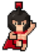
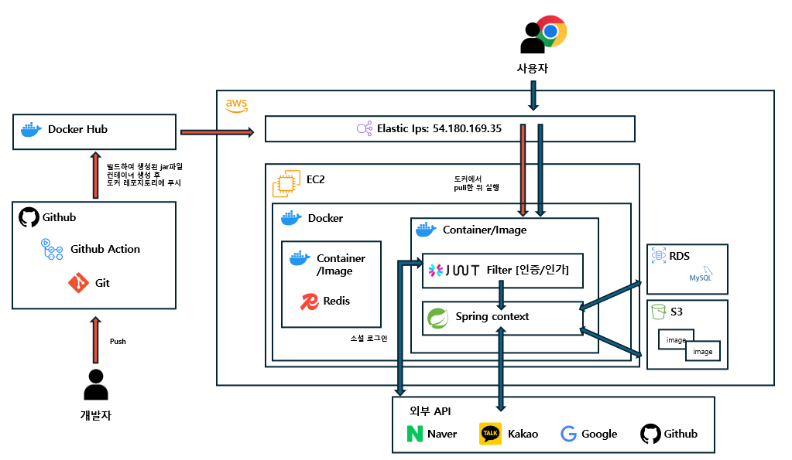

## 🧸KIDS~CAFE
 <br/>

### 다양한 검색 조건으로 전국의 키즈 카페를 검색할 수 있는 서비스 
[📜요구 사항 명세서](https://docs.google.com/spreadsheets/d/1eh0r9hYyVVUQ92XYT-rk2FwpvCrG8vPuZbZYwLYN7ow/edit?gid=0#gid=0)
- 다양한 검색 조건으로 전국의 키즈 카페를 검색
- 초반엔 크롤링으로 전국의 카페를 일괄 등록
- 관리자, 사장님, 유저 권한을 부여하여 각 권한에 따라 이용가능한 기능을 제한
- 소셜로그인 연동으로 간편한 회원가입
- 예약 및 결제 시스템 연동

## 👩‍👧‍👦팀 소개

[📌노션 링크](https://www.notion.so/teamsparta/KIDS-CAFE-1502dc3ef51481c08983c06a64b6fe10)

<table>
    <tr>
        <td></td>
        <td></td>
        <td></td>
        <td></td>
        <td></td>
    </tr>
    <tr>
        <td align="center">👑김혜진<br/>(리더)</td>
        <td align="center">👑박견우<br/>(부리더)</td>
        <td align="center">박도현<br/>(팀원)</td>
        <td align="center">류지수<br/>(팀원)</td>
        <td align="center">김현정<br/>(팀원)</td>
    </tr>
    <tr>
        <td align="center">
            <a href="https://github.com/shushuaka">Github</a> <br/>
            <a href="https://starta.tistory.com/">Blog</a>
        </td>
        <td align="center">
            <a href="https://github.com/gyeonwoo-jerry">Github</a> <br/>
        </td>
        <td align="center">
            <a href="https://github.com/Dohyeon-Parrk?tab=repositories">Github</a> <br/>
            <a href="https://velog.io/@parkyj3213/posts">Blog</a>
        </td>
        <td align="center">
            <a href="https://github.com/dameun0527">Github</a> <br/>
            <a href="https://velog.io/@parkyj3213/posts">Blog</a>
        </td>
        <td align="center">
            <a href="https://github.com/gaeul79">Github</a> <br/>
            <a href="https://velog.io/@gaeul79/posts">Blog</a>
        </td>                        
    </tr>
</table>

## 🖥️시스템 구성도
 <br/>

## 🎨와이어 프레임


## 📋ERD


## 🖥️개발환경
### 🧷사용 언어/라이브러리


### 🧷운용 환경


<br/>


### 🧷개발 환경 & 데이터베이스
 
 <br/>


### 🧷외부 API


## 📑API 명세서
### 🧷유저 API 명세
<table>
    <tr>
        <th>담당자</th>
        <th>Method</th>
        <th>Role</th>
        <th>기능</th>
        <th>API path</th>
        <th>진행 상태</th>
    </tr>
    <tr>
        <td><span style=background-color:#810000AA;font-weight:bold;>박도현</span></td>
        <td><span style=background-color:#786E12AA;font-weight:bold;>POST</span></td>
        <td><code>Public</code></td>
        <td><a href="https://www.notion.so/teamsparta/KIDS-CAFE-1502dc3ef51481c08983c06a64b6fe10?p=1522dc3ef5148104899af5b8fb5fece6&pm=s">🔗회원 가입</a></td>
        <td>/api/auth/signup</td>
        <td><span style=background-color:#22741CAA;font-weight:bold;>완료</span></td>
    </tr>
    <tr>
        <td><span style=background-color:#810000AA;font-weight:bold;>박도현</span></td>
        <td><span style=background-color:#786E12AA;font-weight:bold;>POST</span></td>
        <td><code>Public</code></td>
        <td><a href="https://www.notion.so/teamsparta/KIDS-CAFE-1502dc3ef51481c08983c06a64b6fe10?p=1522dc3ef51481699862d7bfb9f0fdcb&pm=s">🔗로그인</a></td>
        <td>/api/auth/signin</td>
        <td><span style=background-color:#22741CAA;font-weight:bold;>완료</span></td>
    </tr>
    <tr>
        <td><span style=background-color:#810000AA;font-weight:bold;>박도현</span></td>
        <td><span style=background-color:#22741CAA;font-weight:bold;>GET</span></td>
        <td><code>Public</code></td>
        <td><a href="https://www.notion.so/teamsparta/KIDS-CAFE-1502dc3ef51481c08983c06a64b6fe10?p=1522dc3ef51481ac8050f23629d21925&pm=s">🔗소셜 로그인</a></td>
        <td>/api/oauth2/{provider}/signin</td>
        <td><span style=background-color:#22741CAA;font-weight:bold;>완료</span></td>
    </tr>  
    <tr>
        <td><span style=background-color:#4374D9AA;font-weight:bold;>김혜진</span></td>
        <td><span style=background-color:#22741CAA;font-weight:bold;>GET</span></td>
        <td><code>Admin</code></td>
        <td><a href="https://www.notion.so/teamsparta/KIDS-CAFE-1502dc3ef51481c08983c06a64b6fe10?p=5a553c30a7af4d57ad9a8e4d12a82665&pm=s">🔗회원 조회(관리자)</a></td>
        <td>/api/admin/users</td>
        <td><span style=background-color:#22741CAA;font-weight:bold;>완료</span></td>
    </tr>  
    <tr>
        <td><span style=background-color:#4374D9AA;font-weight:bold;>김혜진</span></td>
        <td><span style=background-color:#22741CAA;font-weight:bold;>GET</span></td>
        <td><code>Owner</code></td>
        <td><a href="https://www.notion.so/teamsparta/KIDS-CAFE-1502dc3ef51481c08983c06a64b6fe10?p=5a553c30a7af4d57ad9a8e4d12a82665&pm=s">🔗회원 조회(가게를 즐겨찾기 한)</a></td>
        <td>/api/owners/users</td>
        <td><span style=background-color:#22741CAA;font-weight:bold;>완료</span></td>
    </tr>
    <tr>
        <td><span style=background-color:#4374D9AA;font-weight:bold;>김혜진</span></td>
        <td><span style=background-color:#22741CAA;font-weight:bold;>GET</span></td>
        <td><code>User</code></td>
        <td><a href="https://www.notion.so/teamsparta/KIDS-CAFE-1502dc3ef51481c08983c06a64b6fe10?p=5a553c30a7af4d57ad9a8e4d12a82665&pm=s">🔗프로필 조회</a></td>
        <td>/api/owners/users</td>
        <td><span style=background-color:#22741CAA;font-weight:bold;>완료</span></td>
    </tr>  
    <tr>
        <td><span style=background-color:#4374D9AA;font-weight:bold;>김혜진</span></td>
        <td><span style=background-color:#3B36CFAA;font-weight:bold;>PUT</span></td>
        <td><code>User</code></td>
        <td><a href="https://www.notion.so/teamsparta/KIDS-CAFE-1502dc3ef51481c08983c06a64b6fe10?p=5a553c30a7af4d57ad9a8e4d12a82665&pm=s">🔗프로필 수정</a></td>
        <td>/api/owners/users</td>
        <td><span style=background-color:#22741CAA;font-weight:bold;>완료</span></td>
    </tr>
    <tr>
        <td><span style=background-color:#4374D9AA;font-weight:bold;>김혜진</span></td>
        <td><span style=background-color:#CE3636AA;font-weight:bold;>DELETE</span></td>
        <td><code>User</code></td>
        <td><a href="https://www.notion.so/teamsparta/KIDS-CAFE-1502dc3ef51481c08983c06a64b6fe10?p=5a553c30a7af4d57ad9a8e4d12a82665&pm=s">🔗회원 탈퇴</a></td>
        <td>/api/owners/users</td>
        <td><span style=background-color:#22741CAA;font-weight:bold;>완료</span></td>
    </tr>     
</table>

### 🧷키즈 카페 API 명세
<table>
    <tr>
        <th>담당자</th>
        <th>Method</th>
        <th>Role</th>
        <th>기능</th>
        <th>API path</th>
        <th>진행 상태</th>
    </tr>
    <tr>
        <td><span style=background-color:#22741CAA;font-weight:bold;>김현정</span></td>
        <td><span style=background-color:#786E12AA;font-weight:bold;>POST</span></td>
        <td><code>Admin</code></td>
        <td><a href="https://www.notion.so/teamsparta/KIDS-CAFE-1502dc3ef51481c08983c06a64b6fe10?p=1522dc3ef5148185a3fdf2687c6c38d7&pm=s">🔗카페 등록(관리자)</a></td>
        <td>/api/admin/cafes</td>
        <td><span style=background-color:#22741CAA;font-weight:bold;>완료</span></td>
    </tr>
    <tr>
        <td><span style=background-color:#22741CAA;font-weight:bold;>김현정</span></td>
        <td><span style=background-color:#786E12AA;font-weight:bold;>POST</span></td>
        <td><code>Owner</code></td>
        <td><a href="https://www.notion.so/teamsparta/KIDS-CAFE-1502dc3ef51481c08983c06a64b6fe10?p=1522dc3ef5148171a890d8a4cc12e3e5&pm=s">🔗카페 등록(사장님)</a></td>
        <td>/api/owners/cafes</td>
        <td><span style=background-color:#22741CAA;font-weight:bold;>완료</span></td>
    </tr>
    </tr>
    <tr>
        <td><span style=background-color:#22741CAA;font-weight:bold;>김현정</span></td>
        <td><span style=background-color:#22741CAA;font-weight:bold;>GET</span></td>
        <td><code>Public</code></td>
        <td><a href="https://www.notion.so/teamsparta/KIDS-CAFE-1502dc3ef51481c08983c06a64b6fe10?p=1522dc3ef51481aaa002cc3749dac708&pm=s">🔗카페 리스트 조회(유저가 검색)</a></td>
        <td>/api/cafes</td>
        <td><span style=background-color:#22741CAA;font-weight:bold;>완료</span></td>
    </tr>    
    </tr>
    <tr>
        <td><span style=background-color:#22741CAA;font-weight:bold;>김현정</span></td>
        <td><span style=background-color:#22741CAA;font-weight:bold;>GET</span></td>
        <td><code>Admin</code></td>
        <td><a href="https://www.notion.so/teamsparta/KIDS-CAFE-1502dc3ef51481c08983c06a64b6fe10?p=adce436982904dd4a934109a2ab1482e&pm=s">🔗카페 리스트 조회(관리자 검색)</a></td>
        <td>/api/admin/cafes</td>
        <td><span style=background-color:#22741CAA;font-weight:bold;>완료</span></td>
    </tr>        
    <tr>
        <td><span style=background-color:#22741CAA;font-weight:bold;>김현정</span></td>
        <td><span style=background-color:#22741CAA;font-weight:bold;>GET</span></td>
        <td><code>Owner</code></td>
        <td><a href="https://www.notion.so/teamsparta/KIDS-CAFE-1502dc3ef51481c08983c06a64b6fe10?p=4b4eb283eef744e1ab9cfb2773e81e28&pm=s">🔗카페 리스트 조회(사장님이 등록한)</a></td>
        <td>/api/owners/cafes</td>
        <td><span style=background-color:#22741CAA;font-weight:bold;>완료</span></td>
    </tr>  
    <tr>
        <td><span style=background-color:#22741CAA;font-weight:bold;>김현정</span></td>
        <td><span style=background-color:#22741CAA;font-weight:bold;>GET</span></td>
        <td><code>Public</code></td>
        <td><a href="https://www.notion.so/teamsparta/KIDS-CAFE-1502dc3ef51481c08983c06a64b6fe10?p=28c37adfbca74a109a7ceccaa632b91d&pm=s">🔗카페 상세 조회</a></td>
        <td>/api/cafes/{cafeId}</td>
        <td><span style=background-color:#22741CAA;font-weight:bold;>완료</span></td>
    </tr>    
    <tr>
        <td><span style=background-color:#22741CAA;font-weight:bold;>김현정</span></td>
        <td><span style=background-color:#3B36CFAA;font-weight:bold;>PUT</span></td>
        <td><code>Owner</code></td>
        <td><a href="https://www.notion.so/teamsparta/KIDS-CAFE-1502dc3ef51481c08983c06a64b6fe10?p=ceff199dd2fb4163b22d5ced26374981&pm=s">🔗카페 수정</a></td>
        <td>/api/cafes/{cafeId}</td>
        <td><span style=background-color:#22741CAA;font-weight:bold;>완료</span></td>
    </tr>
    <tr>
        <td><span style=background-color:#22741CAA;font-weight:bold;>김현정</span></td>
        <td><span style=background-color:#CE3636AA;font-weight:bold;>DELETE</span></td>
        <td><code>Admin</code></td>
        <td><a href="https://www.notion.so/teamsparta/KIDS-CAFE-1502dc3ef51481c08983c06a64b6fe10?p=913f5926081b4daf86189a192d7cfac4&pm=s">🔗카페 삭제(관리자)</a></td>
        <td>/api/admin/cafes</td>
        <td><span style=background-color:#22741CAA;font-weight:bold;>완료</span></td>
    </tr>  
    <tr>
        <td><span style=background-color:#22741CAA;font-weight:bold;>김현정</span></td>
        <td><span style=background-color:#CE3636AA;font-weight:bold;>DELETE</span></td>
        <td><code>Owner</code></td>
        <td><a href="https://www.notion.so/teamsparta/KIDS-CAFE-1502dc3ef51481c08983c06a64b6fe10?p=a532f97482d444cfbdf4ec6c6e4818e0&pm=s">🔗카페 삭제(사장님)</a></td>
        <td>/api/owners/cafes</td>
        <td><span style=background-color:#22741CAA;font-weight:bold;>완료</span></td>
    </tr> 
    <tr>
        <td><span style=background-color:#22741CAA;font-weight:bold;>김현정</span></td>
        <td><span style=background-color:#786E12AA;font-weight:bold;>POST</span></td>
        <td><code>Owner</code></td>
        <td><a href="https://www.notion.so/teamsparta/KIDS-CAFE-1502dc3ef51481c08983c06a64b6fe10?p=a277ae00836f490599c67859a26ebf19&pm=s">🔗카페 이미지 업로드</a></td>
        <td>/api/owners/cafes</td>
        <td><span style=background-color:#22741CAA;font-weight:bold;>완료</span></td>
    </tr>  
    <tr>
        <td><span style=background-color:#22741CAA;font-weight:bold;>김현정</span></td>
        <td><span style=background-color:#CE3636AA;font-weight:bold;>DELETE</span></td>
        <td><code>Owner</code></td>
        <td><a href="https://www.notion.so/teamsparta/KIDS-CAFE-1502dc3ef51481c08983c06a64b6fe10?p=77936784df54400088e2f332a1953dac&pm=s">🔗카페 이미지 삭제</a></td>
        <td>/api/owners/cafes</td>
        <td><span style=background-color:#22741CAA;font-weight:bold;>완료</span></td>
    </tr> 
    <tr>
        <td><span style=background-color:#4374D9AA;font-weight:bold;>김혜진</span></td>
        <td><span style=background-color:#786E12AA;font-weight:bold;>POST</span></td>
        <td><code>Admin</code></td>
        <td><a href="https://www.notion.so/teamsparta/KIDS-CAFE-1502dc3ef51481c08983c06a64b6fe10?p=5c87c831a23a4e11b6c28c0ec58b6298&pm=s">🔗카페 크롤링</a></td>
        <td>/api/owners/cafes</td>
        <td><span style=background-color:#22741CAA;font-weight:bold;>완료</span></td>
    </tr>                  
</table>

### 🧷인기 키워드 API 명세
<table>
    <tr>
        <th>담당자</th>
        <th>Method</th>
        <th>Role</th>
        <th>기능</th>
        <th>API path</th>
        <th>진행 상태</th>
    </tr>
    <tr>
        <td><span style=background-color:#8041D9AA;font-weight:bold;>류지수</span></td>
        <td><span style=background-color:#22741CAA;font-weight:bold;>GET</span></td>
        <td><code>Public</code></td>
        <td><a href="https://www.notion.so/teamsparta/KIDS-CAFE-1502dc3ef51481c08983c06a64b6fe10?p=9453f35436704e0f9c501963b6cc4f5e&pm=s">🔗인기 카페(키워드 기반) 검색 v1</a></td>
        <td>/api/cafes/v1/search?keyword={keyword}</td>
        <td><span style=background-color:#3B36CFAA;font-weight:bold;>진행중</span></td>
    </tr>   
    <tr>
        <td><span style=background-color:#8041D9AA;font-weight:bold;>류지수</span></td>
        <td><span style=background-color:#22741CAA;font-weight:bold;>GET</span></td>
        <td><code>Public</code></td>
        <td><a href="https://www.notion.so/teamsparta/KIDS-CAFE-1502dc3ef51481c08983c06a64b6fe10?p=b4334ebc158c440082908a3c85a3fec6&pm=s">🔗인기 키워드 Top 10 v1</a></td>
        <td>/api/cafes/v1/search/keywords/top10</td>
        <td><span style=background-color:#3B36CFAA;font-weight:bold;>진행중</span></td>
    </tr>
    <tr>
        <td><span style=background-color:#8041D9AA;font-weight:bold;>류지수</span></td>
        <td><span style=background-color:#22741CAA;font-weight:bold;>GET</span></td>
        <td><code>Public</code></td>
        <td><a href="https://www.notion.so/teamsparta/KIDS-CAFE-1502dc3ef51481c08983c06a64b6fe10?p=ebbde461c6d14c9eb63c080ec9fde0df&pm=s">🔗인기 카페(키워드 기반) 검색 v2</a></td>
        <td>/api/cafes/v2/search?keyword={keyword}</td>
        <td><span style=background-color:#3B36CFAA;font-weight:bold;>진행중</span></td>
    </tr>   
    <tr>
        <td><span style=background-color:#8041D9AA;font-weight:bold;>류지수</span></td>
        <td><span style=background-color:#22741CAA;font-weight:bold;>GET</span></td>
        <td><code>Public</code></td>
        <td><a href="https://www.notion.so/teamsparta/KIDS-CAFE-1502dc3ef51481c08983c06a64b6fe10?p=d91073f0b0684577b4a096f17b9cbaa2&pm=s">🔗인기 키워드 Top 10 v2</a></td>
        <td>/api/cafes/v2/search/keywords/top10</td>
        <td><span style=background-color:#3B36CFAA;font-weight:bold;>진행중</span></td>
    </tr> 
    <tr>
        <td><span style=background-color:#8041D9AA;font-weight:bold;>류지수</span></td>
        <td><span style=background-color:#22741CAA;font-weight:bold;>GET</span></td>
        <td><code>Public</code></td>
        <td><a href="https://www.notion.so/teamsparta/KIDS-CAFE-1502dc3ef51481c08983c06a64b6fe10?p=cae6605f93cc4eb482052b328ecb3f59&pm=s">🔗인기 카페(키워드 기반) 검색 v3</a></td>
        <td>/api/cafes/v3/search?keyword={keyword}</td>
        <td><span style=background-color:#3B36CFAA;font-weight:bold;>진행중</span></td>
    </tr>   
    <tr>
        <td><span style=background-color:#8041D9AA;font-weight:bold;>류지수</span></td>
        <td><span style=background-color:#22741CAA;font-weight:bold;>GET</span></td>
        <td><code>Public</code></td>
        <td><a href="https://www.notion.so/teamsparta/KIDS-CAFE-1502dc3ef51481c08983c06a64b6fe10?p=3eb12bb5a6a14784b8fe3d477fd089d8&pm=s">🔗인기 키워드 Top 10 v3</a></td>
        <td>/api/cafes/v3/search/keywords/top10</td>
        <td><span style=background-color:#3B36CFAA;font-weight:bold;>진행중</span></td>
    </tr>                   
</table>

### 🧷방 API 명세
<table>
    <tr>
        <th>담당자</th>
        <th>Method</th>
        <th>Role</th>
        <th>기능</th>
        <th>API path</th>
        <th>진행 상태</th>
    </tr>
    <tr>
        <td><span style=background-color:#993800AA;font-weight:bold;>박견우</span></td>
        <td><span style=background-color:#786E12AA;font-weight:bold;>POST</span></td>
        <td><code>Owner</code></td>
        <td><a href="https://www.notion.so/teamsparta/KIDS-CAFE-1502dc3ef51481c08983c06a64b6fe10?p=1522dc3ef51481c4b794f5bfd219e806&pm=s">🔗룸 생성</a></td>
        <td>/api/cafes/{cafeId}/rooms</td>
        <td><span style=background-color:#22741CAA;font-weight:bold;>완료</span></td>
    </tr>
    <tr>
        <td><span style=background-color:#993800AA;font-weight:bold;>박견우</span></td>
        <td><span style=background-color:#22741CAA;font-weight:bold;>GET</span></td>
        <td><code>Public</code></td>
        <td><a href="https://www.notion.so/teamsparta/KIDS-CAFE-1502dc3ef51481c08983c06a64b6fe10?p=ddad18a0ff38468ca569344b0cdb8953&pm=s">🔗룸 조회</a></td>
        <td>/api/cafes/rooms/{roomId}</td>
        <td><span style=background-color:#22741CAA;font-weight:bold;>완료</span></td>
    </tr>
    <tr>
        <td><span style=background-color:#993800AA;font-weight:bold;>박견우</span></td>
        <td><span style=background-color:#3B36CFAA;font-weight:bold;>PUT</span></td>
        <td><code>Owner</code></td>
        <td><a href="https://www.notion.so/teamsparta/KIDS-CAFE-1502dc3ef51481c08983c06a64b6fe10?p=1522dc3ef5148158a481eeb03218ff62&pm=s">🔗룸 수정</a></td>
        <td>/api/cafes/rooms/{roomId}</td>
        <td><span style=background-color:#22741CAA;font-weight:bold;>완료</span></td>
    </tr>    
    <tr>
        <td><span style=background-color:#993800AA;font-weight:bold;>박견우</span></td>
        <td><span style=background-color:#CE3636AA;font-weight:bold;>DELETE</span></td>
        <td><code>Owner</code></td>
        <td><a href="https://www.notion.so/teamsparta/KIDS-CAFE-1502dc3ef51481c08983c06a64b6fe10?p=1522dc3ef5148113b7b6d094bdfa78dc&pm=s">🔗룸 삭제</a></td>
        <td>/api/cafes/rooms/{roomId}</td>
        <td><span style=background-color:#22741CAA;font-weight:bold;>완료</span></td>
    </tr>     
</table>

### 🧷즐겨찾기 API 명세
<table>
    <tr>
        <th>담당자</th>
        <th>Method</th>
        <th>Role</th>
        <th>기능</th>
        <th>API path</th>
        <th>진행 상태</th>
    </tr>
    <tr>
        <td><span style=background-color:#8041D9AA;font-weight:bold;>류지수</span></td>
        <td><span style=background-color:#786E12AA;font-weight:bold;>POST</span></td>
        <td><code>User</code></td>
        <td><a href="https://www.notion.so/teamsparta/KIDS-CAFE-1502dc3ef51481c08983c06a64b6fe10?p=1522dc3ef514816ebb01f8df535cf59f&pm=s">🔗즐겨찾기 추가 및 삭제</a></td>
        <td>/api/cafes/{cafeId}/bookmarks</td>
        <td><span style=background-color:#22741CAA;font-weight:bold;>완료</span></td>
    </tr>
    <tr>
        <td><span style=background-color:#8041D9AA;font-weight:bold;>류지수</span></td>
        <td><span style=background-color:#22741CAA;font-weight:bold;>GET</span></td>
        <td><code>User</code></td>
        <td><a href="https://www.notion.so/teamsparta/KIDS-CAFE-1502dc3ef51481c08983c06a64b6fe10?p=1522dc3ef51481ccb240f7265d564af1&pm=s">🔗즐겨찾기 조회(사용자)</a></td>
        <td>/api/users/bookmarks</td>
        <td><span style=background-color:#22741CAA;font-weight:bold;>완료</span></td>
    </tr>
    <tr>
        <td><span style=background-color:#8041D9AA;font-weight:bold;>류지수</span></td>
        <td><span style=background-color:#22741CAA;font-weight:bold;>GET</span></td>
        <td><code>Owner</code></td>
        <td><a href="https://www.notion.so/teamsparta/KIDS-CAFE-1502dc3ef51481c08983c06a64b6fe10?p=d6715834591f4691b90bf012cad31824&pm=s">🔗즐겨찾기 조회(카페)</a></td>
        <td>/api/owners/bookmarks</td>
        <td><span style=background-color:#22741CAA;font-weight:bold;>완료</span></td>
    </tr>    
</table>

### 🧷리뷰 API 명세
<table>
    <tr>
        <th>담당자</th>
        <th>Method</th>
        <th>Role</th>
        <th>기능</th>
        <th>API path</th>
        <th>진행 상태</th>
    </tr>
    <tr>
        <td><span style=background-color:#993800AA;font-weight:bold;>박견우</span></td>
        <td><span style=background-color:#786E12AA;font-weight:bold;>POST</span></td>
        <td><code>User</code></td>
        <td><a href="https://www.notion.so/teamsparta/KIDS-CAFE-1502dc3ef51481c08983c06a64b6fe10?p=1522dc3ef514819eaf36f72d5e0654f2&pm=s">🔗리뷰 작성</a></td>
        <td>/api/cafes/{cafeId}/reviews</td>
        <td><span style=background-color:#22741CAA;font-weight:bold;>완료</span></td>
    </tr>
    <tr>
        <td><span style=background-color:#993800AA;font-weight:bold;>박견우</span></td>
        <td><span style=background-color:#22741CAA;font-weight:bold;>GET</span></td>
        <td><code>Public</code></td>
        <td><a href="https://www.notion.so/teamsparta/KIDS-CAFE-1502dc3ef51481c08983c06a64b6fe10?p=1522dc3ef51481448deed112bc6fafcd&pm=s">🔗특정 키즈 카페의 리뷰 목록 조회</a></td>
        <td>/api/cafes/{cafeId}/reviews</td>
        <td><span style=background-color:#22741CAA;font-weight:bold;>완료</span></td>
    </tr>
    <tr>
        <td><span style=background-color:#993800AA;font-weight:bold;>박견우</span></td>
        <td><span style=background-color:#22741CAA;font-weight:bold;>GET</span></td>
        <td><code>User</code></td>
        <td><a href="https://www.notion.so/teamsparta/KIDS-CAFE-1502dc3ef51481c08983c06a64b6fe10?p=1fed2462ce874c3eb1abed42336b9994&pm=s">🔗내가 작성한 리뷰 목록 조회</a></td>
        <td>/api/reviews</td>
        <td><span style=background-color:#22741CAA;font-weight:bold;>완료</span></td>
    </tr>    
    <tr>
        <td><span style=background-color:#993800AA;font-weight:bold;>박견우</span></td>
        <td><span style=background-color:#3B36CFAA;font-weight:bold;>PUT</span></td>
        <td><code>User</code></td>
        <td><a href="https://www.notion.so/teamsparta/KIDS-CAFE-1502dc3ef51481c08983c06a64b6fe10?p=530bbc4b207740debe9a161eb9e7ab7a&pm=s">🔗리뷰 수정</a></td>
        <td>/api/reviews/{reviewId}</td>
        <td><span style=background-color:#22741CAA;font-weight:bold;>완료</span></td>
    </tr>     
    <tr>
        <td><span style=background-color:#993800AA;font-weight:bold;>박견우</span></td>
        <td><span style=background-color:#CE3636AA;font-weight:bold;>DELETE</span></td>
        <td><code>User</code></td>
        <td><a href="https://www.notion.so/teamsparta/KIDS-CAFE-1502dc3ef51481c08983c06a64b6fe10?p=1522dc3ef514813dad0bf512b1add793&pm=s">🔗리뷰 삭제</a></td>
        <td>/api/reviews/{reviewId}</td>
        <td><span style=background-color:#22741CAA;font-weight:bold;>완료</span></td>
    </tr>      
    <tr>
        <td><span style=background-color:#993800AA;font-weight:bold;>박견우</span></td>
        <td><span style=background-color:#786E12AA;font-weight:bold;>POST</span></td>
        <td><code>Owner</code></td>
        <td><a href="https://www.notion.so/teamsparta/KIDS-CAFE-1502dc3ef51481c08983c06a64b6fe10?p=01a7d79cc6ef480eac2c412ad32b08b6&pm=s">🔗리뷰 이미지 업로드</a></td>
        <td>/api/reviews/images</td>
        <td><span style=background-color:#22741CAA;font-weight:bold;>완료</span></td>
    </tr>  
    <tr>
        <td><span style=background-color:#993800AA;font-weight:bold;>박견우</span></td>
        <td><span style=background-color:#CE3636AA;font-weight:bold;>DELETE</span></td>
        <td><code>Owner</code></td>
        <td><a href="https://www.notion.so/teamsparta/KIDS-CAFE-1502dc3ef51481c08983c06a64b6fe10?p=36538dc55970490482521e472dbe40b8&pm=s">🔗리뷰 이미지 삭제</a></td>
        <td>/api/reviews/images</td>
        <td><span style=background-color:#22741CAA;font-weight:bold;>완료</span></td>
    </tr>   
    <tr>
        <td><span style=background-color:#993800AA;font-weight:bold;>박견우</span></td>
        <td><span style=background-color:#786E12AA;font-weight:bold;>POST</span></td>
        <td><code>User</code></td>
        <td><a href="https://www.notion.so/teamsparta/KIDS-CAFE-1502dc3ef51481c08983c06a64b6fe10?p=1602dc3ef5148177b286cf8cf5efda1a&pm=s">🔗리뷰 추천 & 추천 취소</a></td>
        <td>/api/review/recommend/{review_id}</td>
        <td><span style=background-color:#22741CAA;font-weight:bold;>완료</span></td>
    </tr>       
    <tr>
        <td><span style=background-color:#4374D9AA;font-weight:bold;>김혜진</span></td>
        <td><span style=background-color:#786E12AA;font-weight:bold;>POST</span></td>
        <td><code>User</code></td>
        <td><a href="https://www.notion.so/teamsparta/KIDS-CAFE-1502dc3ef51481c08983c06a64b6fe10?p=1602dc3ef5148140b277d57dfb4820e7&pm=s">🔗영수증 리뷰</a></td>
        <td>/api/cafes/{cafeId}/receipts/reviews</td>
        <td><span style=background-color:#22741CAA;font-weight:bold;>완료</span></td>
    </tr>       
</table>

### 🧷리뷰 신고 API 명세
<table>
    <tr>
        <th>담당자</th>
        <th>Method</th>
        <th>Role</th>
        <th>기능</th>
        <th>API path</th>
        <th>진행 상태</th>
    </tr>
    <tr>
        <td><span style=background-color:#993800AA;font-weight:bold;>박견우</span></td>
        <td><span style=background-color:#786E12AA;font-weight:bold;>POST</span></td>
        <td><code>Owner</code></td>
        <td><a href="https://www.notion.so/teamsparta/KIDS-CAFE-1502dc3ef51481c08983c06a64b6fe10?p=1572dc3ef5148140af4ec251f5495426&pm=s">🔗신고 생성(사장님)</a></td>
        <td>/api/reviews/{reviewId}/reports</td>
        <td><span style=background-color:#22741CAA;font-weight:bold;>완료</span></td>
    </tr>
    <tr>
        <td><span style=background-color:#993800AA;font-weight:bold;>박견우</span></td>
        <td><span style=background-color:#22741CAA;font-weight:bold;>GET</span></td>
        <td><code>Owner</code></td>
        <td><a href="https://www.notion.so/teamsparta/KIDS-CAFE-1502dc3ef51481c08983c06a64b6fe10?p=1572dc3ef5148104b7f2e815288976e4&pm=s">🔗사장님 본인이 신고한 신고 목록 조회(사장님)</a></td>
        <td>/api/owners/reports</td>
        <td><span style=background-color:#22741CAA;font-weight:bold;>완료</span></td>
    </tr>
    <tr>
        <td><span style=background-color:#993800AA;font-weight:bold;>박견우</span></td>
        <td><span style=background-color:#22741CAA;font-weight:bold;>GET</span></td>
        <td><code>Admin</code></td>
        <td><a href="https://www.notion.so/teamsparta/KIDS-CAFE-1502dc3ef51481c08983c06a64b6fe10?p=1572dc3ef514818496ccefff8aed755e&pm=s">🔗사장님들이 신고한 신고 목록 조회(관리자)</a></td>
        <td>/api/admin/reports</td>
        <td><span style=background-color:#22741CAA;font-weight:bold;>완료</span></td>
    </tr>    
    <tr>
        <td><span style=background-color:#993800AA;font-weight:bold;>박견우</span></td>
        <td><span style=background-color:#FF007FAA;font-weight:bold;>PATCH</span></td>
        <td><code>Admin</code></td>
        <td><a href="https://www.notion.so/teamsparta/KIDS-CAFE-1502dc3ef51481c08983c06a64b6fe10?p=a90c62571e1449879b1f1b4f74dd9275&pm=s">🔗신고 상태 변경</a></td>
        <td>/api/reports/{reportId}</td>
        <td><span style=background-color:#22741CAA;font-weight:bold;>완료</span></td>
    </tr>    
</table>

### 🧷예약 API 명세
<table>
    <tr>
        <th>담당자</th>
        <th>Method</th>
        <th>Role</th>
        <th>기능</th>
        <th>API path</th>
        <th>진행 상태</th>
    </tr>
    <tr>
        <td><span style=background-color:#8041D9AA;font-weight:bold;>류지수</span></td>
        <td><span style=background-color:#786E12AA;font-weight:bold;>POST</span></td>
        <td><code>User</code></td>
        <td><a href="https://www.notion.so/teamsparta/KIDS-CAFE-1502dc3ef51481c08983c06a64b6fe10?p=1522dc3ef5148170b630ee213389eab5&pm=s">🔗예약 생성</a></td>
        <td>/api/reservations/cafes/{cafeId}</td>
        <td><span style=background-color:#22741CAA;font-weight:bold;>완료</span></td>
    </tr>
    <tr>
        <td><span style=background-color:#8041D9AA;font-weight:bold;>류지수</span></td>
        <td><span style=background-color:#22741CAA;font-weight:bold;>GET</span></td>
        <td><code>User</code></td>
        <td><a href="https://www.notion.so/teamsparta/KIDS-CAFE-1502dc3ef51481c08983c06a64b6fe10?p=1522dc3ef51481b4b1e9dae6e477b223&pm=s">🔗예약 내역 조회(사용자)</a></td>
        <td>/api/users/reservations</td>
        <td><span style=background-color:#22741CAA;font-weight:bold;>완료</span></td>
    </tr>
    <tr>
        <td><span style=background-color:#8041D9AA;font-weight:bold;>류지수</span></td>
        <td><span style=background-color:#22741CAA;font-weight:bold;>GET</span></td>
        <td><code>Owner</code></td>
        <td><a href="https://www.notion.so/teamsparta/KIDS-CAFE-1502dc3ef51481c08983c06a64b6fe10?p=90b596908b1646febd1dd8339f1c1931&pm=s">🔗예약 내역 조회(카페)</a></td>
        <td>/api/owners/reservations/cafes/{cafeId}</td>
        <td><span style=background-color:#22741CAA;font-weight:bold;>완료</span></td>
    </tr>    
    <tr>
        <td><span style=background-color:#8041D9AA;font-weight:bold;>류지수</span></td>
        <td><span style=background-color:#22741CAA;font-weight:bold;>GET</span></td>
        <td><code>Owner</code></br><code>User</code></td>
        <td><a href="https://www.notion.so/teamsparta/KIDS-CAFE-1502dc3ef51481c08983c06a64b6fe10?p=14992634e63845689093899430ce2316&pm=s">🔗예약 상세 조회</a></td>
        <td>/api/users/reservations/{reservationId}</br>/api/owners/reservations/{reservationId}</td>
        <td><span style=background-color:#22741CAA;font-weight:bold;>완료</span></td>
    </tr>    
     <tr>
        <td><span style=background-color:#8041D9AA;font-weight:bold;>류지수</span></td>
        <td><span style=background-color:#3B36CFAA;font-weight:bold;>PUT</span></td>
        <td><code>User</code></td>
        <td><a href="https://www.notion.so/teamsparta/KIDS-CAFE-1502dc3ef51481c08983c06a64b6fe10?p=3a2536eb2ed945e5a4e5c99edc1a58b7&pm=s">🔗예약 정보 수정</a></td>
        <td>/api/users/reservations/{reservationId}/update</td>
        <td><span style=background-color:#22741CAA;font-weight:bold;>완료</span></td>
    </tr>   
    <tr>
        <td><span style=background-color:#8041D9AA;font-weight:bold;>류지수</span></td>
        <td><span style=background-color:#3B36CFAA;font-weight:bold;>PUT</span></td>
        <td><code>Owner</code></td>
        <td><a href="https://www.notion.so/teamsparta/KIDS-CAFE-1502dc3ef51481c08983c06a64b6fe10?p=b7b9ba7469e94d908115e7cb569db599&pm=s">🔗예약 수락</a></td>
        <td>/api/owners/reservations/{reservationId}/approve</td>
        <td><span style=background-color:#22741CAA;font-weight:bold;>완료</span></td>
    </tr>  
    <tr>
        <td><span style=background-color:#8041D9AA;font-weight:bold;>류지수</span></td>
        <td><span style=background-color:#3B36CFAA;font-weight:bold;>PUT</span></td>
        <td><code>Owner</code></td>
        <td><a href="https://www.notion.so/teamsparta/KIDS-CAFE-1502dc3ef51481c08983c06a64b6fe10?p=db53af70dfe44c1e9f46dc922abd3b77&pm=s">🔗예약 상태 변경</a></td>
        <td>/api/owners/reservations/{reservationId}/complete</td>
        <td><span style=background-color:#22741CAA;font-weight:bold;>완료</span></td>
    </tr>          
    <tr>
        <td><span style=background-color:#8041D9AA;font-weight:bold;>류지수</span></td>
        <td><span style=background-color:#3B36CFAA;font-weight:bold;>PUT</span></td>
        <td><code>Owner</code></br><code>User</code></td>
        <td><a href="https://www.notion.so/teamsparta/KIDS-CAFE-1502dc3ef51481c08983c06a64b6fe10?p=962f529cb3bc479db01e4698f3dcb95f&pm=s">🔗예약 취소</a></td>
        <td>/api/users/reservations/{reservationId}/cancel</br>/api/owners/reservations/{reservationId}/{cafeId}/cancel</td>
        <td><span style=background-color:#22741CAA;font-weight:bold;>완료</span></td>
    </tr>        
</table>

### 🧷가격 정책 API 명세
<table>
    <tr>
        <th>담당자</th>
        <th>Method</th>
        <th>Role</th>
        <th>기능</th>
        <th>API path</th>
        <th>진행 상태</th>
    </tr>
    <tr>
        <td><span style=background-color:#4374D9AA;font-weight:bold;>김혜진</span></td>
        <td><span style=background-color:#786E12AA;font-weight:bold;>POST</span></td>
        <td><code>Owner</code></td>
        <td><a href="https://www.notion.so/teamsparta/KIDS-CAFE-1502dc3ef51481c08983c06a64b6fe10?p=1522dc3ef5148178a8b4f33a8acf4e19&pm=s">🔗가격 정책 추가</a></td>
        <td>/api/cafes/{cafeId}/prices</td>
        <td><span style=background-color:#22741CAA;font-weight:bold;>완료</span></td>
    </tr>
    <tr>
        <td><span style=background-color:#4374D9AA;font-weight:bold;>김혜진</span></td>
        <td><span style=background-color:#22741CAA;font-weight:bold;>GET</span></td>
        <td><code>Owner</code></td>
        <td><a href="https://www.notion.so/teamsparta/KIDS-CAFE-1502dc3ef51481c08983c06a64b6fe10?p=1522dc3ef514812292add8761389f16a&pm=s">🔗가격 정책 조회</a></td>
        <td>/api/cafes/{cafeId}/prices</td>
        <td><span style=background-color:#22741CAA;font-weight:bold;>완료</span></td>
    </tr>
    <tr>
        <td><span style=background-color:#4374D9AA;font-weight:bold;>김혜진</span></td>
        <td><span style=background-color:#FF007FAA;font-weight:bold;>PATCH</span></td>
        <td><code>Owner</code></td>
        <td><a href="https://www.notion.so/teamsparta/KIDS-CAFE-1502dc3ef51481c08983c06a64b6fe10?p=21d5a4aaf5694e04afda33d490cf6d25&pm=s">🔗가격 정책 수정</a></td>
        <td>/api/cafes/{cafeId}/prices/{pricesId}</td>
        <td><span style=background-color:#22741CAA;font-weight:bold;>완료</span></td>
    </tr>  
    <tr>
        <td><span style=background-color:#4374D9AA;font-weight:bold;>김혜진</span></td>
        <td><span style=background-color:#CE3636AA;font-weight:bold;>DELETE</span></td>
        <td><code>Owner</code></td>
        <td><a href="https://www.notion.so/teamsparta/KIDS-CAFE-1502dc3ef51481c08983c06a64b6fe10?p=b14ba52d4bbf4b3ba301784b4544e083&pm=s">🔗가격 정책 삭제</a></td>
        <td>/api/cafes/{cafeId}/prices/{pricesId}</td>
        <td><span style=background-color:#22741CAA;font-weight:bold;>완료</span></td>
    </tr>       
</table>

### 🧷입장료 API 명세
<table>
    <tr>
        <th>담당자</th>
        <th>Method</th>
        <th>Role</th>
        <th>기능</th>
        <th>API path</th>
        <th>진행 상태</th>
    </tr>
    <tr>
        <td><span style=background-color:#810000AA;font-weight:bold;>박도현</span></td>
        <td><span style=background-color:#FF007FAA;font-weight:bold;>PATCH</span></td>
        <td><code>Owner</code></td>
        <td><a href="https://www.notion.so/teamsparta/KIDS-CAFE-1502dc3ef51481c08983c06a64b6fe10?p=1532dc3ef51481ae9a0ed810da872923&pm=s">🔗입장료 수정</a></td>
        <td>/api/cafes/{cafeId}/fees/{feeId}</td>
        <td><span style=background-color:#22741CAA;font-weight:bold;>완료</span></td>
    </tr>      
</table>

### 🧷이미지 API 명세
<table>
    <tr>
        <th>담당자</th>
        <th>Method</th>
        <th>Role</th>
        <th>기능</th>
        <th>API path</th>
        <th>진행 상태</th>
    </tr>
    <tr>
        <td><span style=background-color:#22741CAA;font-weight:bold;>김현정</span></td>
        <td><span style=background-color:#CE3636AA;font-weight:bold;>DELETE</span></td>
        <td><code>Admin</code></td>
        <td><a href="https://www.notion.so/teamsparta/KIDS-CAFE-1502dc3ef51481c08983c06a64b6fe10?p=15a2dc3ef514819e8fcbe821eac18374&pm=s">🔗유령 이미지 삭제</a></td>
        <td>/api/images</td>
        <td><span style=background-color:#22741CAA;font-weight:bold;>완료</span></td>
    </tr>      
</table>

### 🧷프로그램 API 명세
<table>
    <tr>
        <th>담당자</th>
        <th>Method</th>
        <th>Role</th>
        <th>기능</th>
        <th>API path</th>
        <th>진행 상태</th>
    </tr>
    <tr>
        <td><span style=background-color:#22741CAA;font-weight:bold;>김현정</span></td>
        <td><span style=background-color:#786E12AA;font-weight:bold;>POST</span></td>
        <td><code>Owner</code></td>
        <td><a href="https://www.notion.so/teamsparta/KIDS-CAFE-1502dc3ef51481c08983c06a64b6fe10?p=1602dc3ef5148147957ecbefbeee8a3c&pm=s">🔗키즈 카페 프로그램 추가</a></td>
        <td>/api/cafes/{cafeId}/lessons</td>
        <td><span style=background-color:#22741CAA;font-weight:bold;>완료</span></td>
    </tr>
    <tr>
        <td><span style=background-color:#22741CAA;font-weight:bold;>김현정</span></td>
        <td><span style=background-color:#22741CAA;font-weight:bold;>GET</span></td>
        <td><code>Owner</code></td>
        <td><a href="https://www.notion.so/teamsparta/KIDS-CAFE-1502dc3ef51481c08983c06a64b6fe10?p=1602dc3ef51481f6816afa608cfb2b87&pm=s">🔗키즈 카페 프로그램 조회</a></td>
        <td>/api/cafes/{cafeId}/lessons</td>
        <td><span style=background-color:#22741CAA;font-weight:bold;>완료</span></td>
    </tr>
    <tr>
        <td><span style=background-color:#22741CAA;font-weight:bold;>김현정</span></td>
        <td><span style=background-color:#FF007FAA;font-weight:bold;>PATCH</span></td>
        <td><code>Owner</code></td>
        <td><a href="https://www.notion.so/teamsparta/KIDS-CAFE-1502dc3ef51481c08983c06a64b6fe10?p=1602dc3ef51481e19e01c1f2d321633e&pm=s">🔗키즈 카페 프로그램 수정</a></td>
        <td>/api/lessons/{lessionId}</td>
        <td><span style=background-color:#22741CAA;font-weight:bold;>완료</span></td>
    </tr>  
    <tr>
        <td><span style=background-color:#22741CAA;font-weight:bold;>김현정</span></td>
        <td><span style=background-color:#CE3636AA;font-weight:bold;>DELETE</span></td>
        <td><code>Owner</code></td>
        <td><a href="https://www.notion.so/teamsparta/KIDS-CAFE-1502dc3ef51481c08983c06a64b6fe10?p=8f295e91de244460ae83f10bdc801b30&pm=s">🔗키즈 카페 프로그램 삭제</a></td>
        <td>/api/lessons/{lessonId}</td>
        <td><span style=background-color:#22741CAA;font-weight:bold;>완료</span></td>
    </tr>       
</table>

### 🧷쿠폰 API 명세
<table>
    <tr>
        <th>담당자</th>
        <th>Method</th>
        <th>Role</th>
        <th>기능</th>
        <th>API path</th>
        <th>진행 상태</th>
    </tr>
    <tr>
        <td><span style=background-color:#810000AA;font-weight:bold;>박도현</span></td>
        <td><span style=background-color:#786E12AA;font-weight:bold;>POST</span></td>
        <td><code>Owner</code></td>
        <td><a href="https://www.notion.so/teamsparta/KIDS-CAFE-1502dc3ef51481c08983c06a64b6fe10?p=1602dc3ef51481b99299e2d51a809379&pm=s">🔗쿠폰 생성</a></td>
        <td>/api/cafes/{cafeId}/coupons</td>
        <td><span style=background-color:#22741CAA;font-weight:bold;>완료</span></td>
    </tr>
    <tr>
        <td><span style=background-color:#810000AA;font-weight:bold;>박도현</span></td>
        <td><span style=background-color:#22741CAA;font-weight:bold;>GET</span></td>
        <td><code>User</code></td>
        <td><a href="https://www.notion.so/teamsparta/KIDS-CAFE-1502dc3ef51481c08983c06a64b6fe10?p=1602dc3ef514819aa5c9e1b517b54578&pm=s">🔗쿠폰 조회(사용자)</a></td>
        <td>/api/users/coupons</td>
        <td><span style=background-color:#22741CAA;font-weight:bold;>완료</span></td>
    </tr>
    <tr>
        <td><span style=background-color:#810000AA;font-weight:bold;>박도현</span></td>
        <td><span style=background-color:#22741CAA;font-weight:bold;>GET</span></td>
        <td><code>Owner</code></td>
        <td><a href="https://www.notion.so/teamsparta/KIDS-CAFE-1502dc3ef51481c08983c06a64b6fe10?p=93b3f63528df45cfbbcde3f28280dc79&pm=s">🔗쿠폰 조회(사장님)</a></td>
        <td>/api/owners/cafes/{cafeId}/coupons</td>
        <td><span style=background-color:#22741CAA;font-weight:bold;>완료</span></td>
    </tr>    
    <tr>
        <td><span style=background-color:#810000AA;font-weight:bold;>박도현</span></td>
        <td><span style=background-color:#786E12AA;font-weight:bold;>POST</span></td>
        <td><code>Owner</code></td>
        <td><a href="https://www.notion.so/teamsparta/KIDS-CAFE-1502dc3ef51481c08983c06a64b6fe10?p=33a44004e8cd4c459927d7c921fee3e7&pm=s">🔗쿠폰 지급</a></td>
        <td>/api/{couponId}/assign/{userId}</td>
        <td><span style=background-color:#22741CAA;font-weight:bold;>완료</span></td>
    </tr>  
    <tr>
        <td><span style=background-color:#810000AA;font-weight:bold;>박도현</span></td>
        <td><span style=background-color:#786E12AA;font-weight:bold;>POST</span></td>
        <td><code>User</code></td>
        <td><a href="https://www.notion.so/teamsparta/KIDS-CAFE-1502dc3ef51481c08983c06a64b6fe10?p=8a1f11c250d64b4fb8e5163edfea8331&pm=s">🔗쿠폰 사용</a></td>
        <td>/api/{couponId}/use</td>
        <td><span style=background-color:#22741CAA;font-weight:bold;>완료</span></td>
    </tr>       
</table>

## 🗂️프로젝트 구조
```bash
'KidsCafe'
├── 'api'                     # API와 관련된 컨트롤러, 필터, 인터셉터, 외부 연동 로직
│   ├── 'auth'                # 인증 및 인증 관련 로직
│   │   ├── 'controller'      # 인증 요청을 처리하는 컨트롤러
│   │   ├── 'exception'       # 인증 관련 예외 처리
│   │   └── 'service'         # 인증 서비스 로직
│   ├── 'filter'              # 요청 필터 처리
│   ├── 'interceptor'         # 인터셉터를 통한 요청/응답 처리
│   ├── 'kakao'               # 카카오 API와의 연동
│   ├── 'naver'               # 네이버 API와의 연동
│   └── 'oauth2'              # OAuth2 인증 관련 모듈
│       ├── 'adapter'         # OAuth2 어댑터 구성
│       ├── 'config'          # OAuth2 설정
│       ├── 'controller'      # OAuth2 관련 요청 처리
│       ├── 'provider'        # OAuth2 제공자 설정
│       └── 'service'         # OAuth2 서비스 로직
├── 'common'                  # 공통 모듈 및 유틸리티
│   ├── 'annotation'          # 어노테이션 정의
│   ├── 'config'              # 공통 설정
│   ├── 'dto'                 # 공통적으로 사용되는 데이터 객체
│   ├── 'entity'              # 공통 엔티티 정의
│   ├── 'enums'               # 공통 Enum 정의
│   └── 'util'                # 공통 유틸리티
├── 'config'                  # 프로젝트 전체 설정
├── 'domain'                  # 비즈니스 도메인 모듈
│   ├── 'bookmark'            # 즐겨찾기 관리
│   ├── 'cafe'                # 카페 관련 도메인
│   ├── 'coupon'              # 쿠폰 관리
│   ├── 'fee'                 # 요금 관리
│   ├── 'image'               # 이미지 관리
│   ├── 'lesson'              # 레슨 관리
│   ├── 'pricepolicy'         # 가격 정책 관리
│   ├── 'recommend'           # 추천 시스템
│   ├── 'report'              # 신고 관리
│   ├── 'reservation'         # 예약 관리
│   ├── 'review'              # 리뷰 및 영수증 스캔
│   ├── 'room'                # 룸 정보 관리
│   └── 'user'                # 사용자 관리
├── 'dummy'                   # 테스트 데이터 생성
└── 'exception'               # 전역 예외 처리 및 예외 클래스
```
